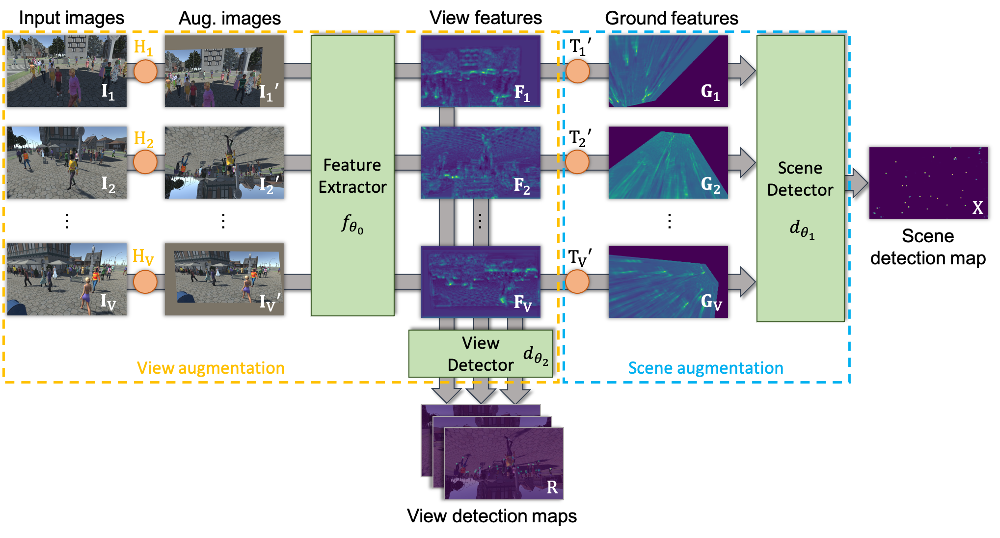

# Two-level Data Augmentation for Calibrated Multi-view Detection

<div style="text-align:center"></div>


## Getting Started


#### Data
The Wildtrack and MultiviewX datasets can be found using the following links:

* [MultiviewX](https://github.com/hou-yz/MultiviewX) 
* [WILDTRACK](https://www.epfl.ch/labs/cvlab/data/data-wildtrack/)

After downloading the datasets, you can edit the files `data/SceneSetConfigs/wildtrack_train.json` and`data/SceneSetConfigs/multiviewX_train.json` to set `data_root` with the locations of the datasets. 

#### Dependencies

* pytorch=1.7.1
* torchvision
* opencv=4.5.3
* sympy
* motmetrics
* shapely

## Model evaluation

We provide the weights of our best model trained on Wildtrack ([Wildtrack best weight](https://drive.google.com/file/d/13Kfaiy3qu9hcxB-vXwoEAO5ZvJ-x83AZ/view?usp=sharing)).
To evaluate this model, run the following command after putting the downloaded file in the `/weights/` folder.

```sh
python evaluation.py weights/best_model_736.pth.tar
```

Note that the output metrics by the above command are computed with the pymotmetric library. To be consistent with previous work, metrics in the paper are computed with matlab motchallenge library. After running the above command ground truth and GT should have been created in the detections_results folder.
We provide the matlab evaluation script taking those files and computing the metric in `misc/matlabeval/evaluate.py`
To run it you need to add the matlab [motchallenge-devkit](https://github.com/hou-yz/MVDet/tree/master/multiview_detector/evaluation/motchallenge-devkit) in the following folder /misc/matlabeval/motchallenge-devkit. Then you can run the following command:


```sh
python evaluate.py model_736
```

## Model training

For each dataset we provide two configuration files to train our model with and without prediction in individual views.

```sh
# Wildtrack Training

# ground plane supervision only
python train.py -cfg configs/config_detection.yaml -n model_name_1
# ground plane + individual view supervision
python train.py -cfg configs/config_detection_framepred.yaml -n model_name_2

# MultiviewX Training

# ground plane supervision only
python train.py -cfg configs/config_detectionmvx.yaml -n model_name_3
# ground plane + individual view supervision
python train.py -cfg configs/config_detection_framepredmvx.yaml -n model_name_4
```

All the commands above don't include any form of augmentation. Augmentation can be added with arguments as follows:

```sh
python train.py -cfg configs/config_detection_framepred.yaml -n model_name_2 -aug -vaug rcrop,0.5 -saug raff,0.5
```

Command line arguments `-vaug` and `-saug` can be used to add view and scene augmentation respectively. The type of augmentation is specified as a list of tuple such as `AugType1,prob1 AugType2,prob2 ... AugTypeN,probN`. The abbreviated augmentation names can be found in `dataset/utils.py` in the `get_augmentation`functions.

<details>
  <summary>Augmentation list</summary>


```python
def get_augmentation(tuple_aug_list, frame_size):

    aug_dir = {
        "rcrop": transforms.RandomResizedCrop(frame_size),
        "raff": transforms.RandomAffine(degrees = 45, translate = (0.2, 0.2), scale = (0.8,1.2), shear = 10),
        "raff_nor" : transforms.RandomAffine(degrees = 0, translate = (0.2, 0.2), scale = (0.8,1.2), shear = 10),
        "raff_hr" : transforms.RandomAffine(degrees = 360, translate = (0.2, 0.2), scale = (0.8,1.2), shear = 10),
        "raff_nos" : transforms.RandomAffine(degrees = 0, translate = (0.2, 0.2), scale = None, shear = None),
        "raff_ht" : transforms.RandomAffine(degrees = 0, translate = (0.4, 0.4), scale = None, shear = None),
        "vflip"  : transforms.RandomVerticalFlip(p = 1.0),
        "hflip"  : transforms.RandomHorizontalFlip(p = 1.0),
        "rpersp" : transforms.RandomPerspective(distortion_scale=0.5, p=1.0),
        "rpersph" : transforms.RandomPerspective(distortion_scale=0.3, p=1.0),
        "rpersps" : transforms.RandomPerspective(distortion_scale=0.7, p=1.0),
        None:None   
    }
```
</details>

## Torchvision transformation wrapper

As part of this work, we adapted existing torchvision geometric transformations to the multiview context. To do so we needed to be able to repeat a transformation, applying the same modification to multiple images. We also needed to have access to parameters corresponding to the transformation. To achieve both this goal we proposed a small library contained in the augmentation folder. The following sections contain examples of how to use it.

#### Reapeatable Augmentation

The file `augmentation/repeatabletransform.py`contains a wrapper for any torchvision transformation which allows application of the same transformation to multiple tensors. It works as follows:

```python

#RepeatableTransform take the desired torchvision transform as input
repeatable_aug = RepeatableTransform(torchvision.transforms.RandomCrop(224))

#The first forward randomly sample transformation parameters
img1_aug = repeatable_aug(img1)
#Following forward calls will all apply the same transformation
img2_aug = repeatable_aug(img2)

#After calling reset, new transformation parameter will be sampled on the next forward call
repeatable_aug.reset()

#img1, and img2 are both modified with the same new transformation
img1_other_aug = repeatable_aug(img1)
img2_other_aug = repeatable_aug(img2)
```

#### Homography of the transformation

The file `augmentation/alignedaugmentation.py` contains wrappers for the most common torchvision geometric transformations (RandomAffine, RandomResizedCrop, RandomHorizontalFlip, RandomVerticalFlip, RandomPerspective). All those classes inherit the RepeatableTransform and its property (reset function needed to sample new parameters). 

Additionally they implement the get_aug_transform_matrix method that returns the homography corresponding to the last transformation applied.


```python
#HomographyDataAugmentation take the most common torchvision geometric transform as input
aff_aug = AlignedAffineTransform(torchvision.transforms.RandomAffine(45))

#after applying the transformation, calling get_aug_transform_matrix will return the corresponding homography
img1_aug = aff_aug(img1)
homography_aug = aff_aug.get_aug_transform_matrix()

#It is a child class of RepeatableTransform, so it inherits the repeatable feature.
aff_aug.reset()
```

#### Augmentation library for multiview
The file `augmentation/homographyaugmentation.py` contains the class used to apply data augmentation in a calibrated multiview context. 
It also wraps the trochvision geometric transformation listed above. It directly provides helper function to augment, ground plane homography as well as ground truth points.

```python
persp_aug = HomographyDataAugmentation(torchvision.transforms.RandomPerspective())

#apply the same augmentation to image, ground truth points, and ground plane projection matrix
img_view1_aug = persp_aug(img_view1)
gt_view1_aug = persp_aug.augment_gt_point_view_based(gt_view1)
proj_view1_aug = persp_aug.augment_homography_view_based(proj1)

#Reinitialize the transform parameters
persp_aug.reset()

#Apply another transformation to a different view
img_view2_aug = persp_aug(img_view2)
gt_view2_aug = persp_aug.augment_gt_point_view_based(gt_view2)
proj_view2_aug = persp_aug.augment_homography_view_based(proj2)

#Reinitialize the transform parameters
persp_aug.reset()

#Apply same scene augmentation to ground plane projection matrix of multiple views
proj_view1_aug_scene = persp_aug.augment_homography_scene_based(proj_view1_aug)
proj_view2_aug_scene = persp_aug.augment_homography_scene_based(proj_view2_aug)
```


## Reference
If you found this code useful, please cite the following paper:

    @inproceedings{engilber2023two,
	  title={Two-level Data Augmentation for Calibrated Multi-view Detection},
	  author={Engilberge, Martin and Shi, Haixin and Wang, Zhiye and Fua, Pascal},
	  booktitle={Proceedings of the IEEE/CVF Winter Conference on Applications of Computer Vision},
	  year={2023}
	}

## License
By downloading this program, you commit to comply with the license as stated in the LICENSE file.
